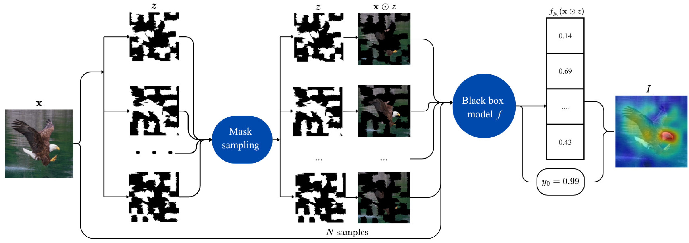
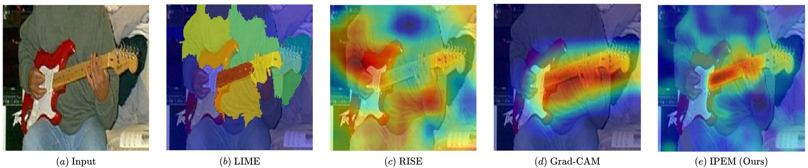
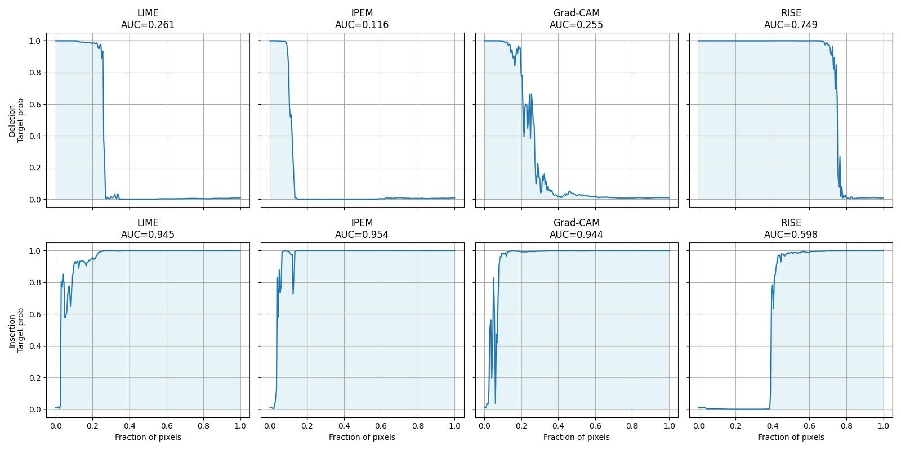

# IPEM: Input Perturbation-based Explanation Method for Deep Learning models on Image data

[](https://opensource.org/licenses/MIT)
[](https://www.python.org/downloads/)

## 📖 Introduction
Despite the considerable success of deep learning models in many complicated tasks, the lack of transparency in these models significantly poses a barrier to user trust. This issue has gradually emerged as a new challenge and as a foundation for the development of Explainable Artificial Intelligence (XAI). However, several XAI methods still suffer notable limitations, particularly with respect to reliability in explanations and computational cost. 

In this paper, we propose IPEM, a perturbation-based explanation method specifically designed for image data. By generating perturbed versions of the original input and leveraging the corresponding prediction variations, IPEM provides explanations by estimating the contribution of image regions. Experimental results indicate that IPEM effectively identifies salient features while maintaining stability and accuracy in its explanations. These advantages position IPEM as a promising tool for developing transparent and reliable AI systems

## 🌟 Workflow of IPEM


**IPEM explains the image by four following steps:**

***Step 1: Baseline prediction*** \
Given an input image $x$ and a trained classification model $f$. The main objective of the method is to construct an explanation map $I$ that reflects the contribution
of image regions to the model’s prediction.

***Step 2: Mask sampling***\
The input image is segmented into superpixels by Watershed algorithm. Then Monte Carlo simulation process is carried out by randomly generating binary perturbation samples, from which representative samples are drawn according to a Bernoulli distribution with probability $p$. Then, the number of Monte Carlo samples is chosen adaptively based on the grid resolution to ensure statistical reliability.

***Step 3: Importance estimation***\
The fundamental concept behind IPEM is to evaluate how each specific region of an image influences the model's final decision. We achieve this by generating multiple randomly masked versions of the input image and observing the changes in the model's confidence.

For any given region $z$, we divide the model's prediction probabilities into two groups:
- "ON" group: Predictions where the region is kept visible.
- "OFF" group: Predictions where the region is masked.

By calculating the expected probability for both groups ($\mu_{on}$ and $\mu_{off}$), we can measure the region's contribution. Intuitively, if the model's confidence drops significantly when a region is hidden, that region is highly important for the classification.

To ensure the explanation remains stable and is not skewed by the randomness of the Monte Carlo sampling, the difference between these expectations is normalized by their variance.

***Step 4: Multi-grid fusion***\
All the above processes are performed under a single number of segments. Therefore, when a list of number of segments are used, the explanation maps at different resolutions are averaged to produce the final explanation map.

## 📊 Evaluated Datasets & Models

As a tool built for computer vision tasks, the method was rigorously evaluated on three benchmark datasets:
* **Caltech-101:** Contains 101 object categories with moderate intra-class variability.
* **Brain Tumor Dataset:** Consists of MRI brain images used for tumor classification, characterized by subtle structural differences and high noise levels.

Supported deep learning architectures include:
* **Transformer (Vision Transformer)**
* **EfficientNet-B3**
* **ResNet50**

**The explanation result after using IPEM:**\


**Insertion-Deletion Comparision demonstrates how good IPEM's performance is**:


## ⚙️ Installation and Run Guide
**Hardware Note:** The original experiments were conducted on a system equipped with 16GB RAM and an NVIDIA GeForce RTX 3050 GPU (4GB VRAM).\
**Software Note:** This repository requires Python **3.11 or lower**. For the frontend environment, use **Node.js 22 LTS**, which includes a compatible version of **npm** for modern Vite-based projects.

**1. Clone the repository**
```cmd
git clone https://github.com/hbkhanh22/IPEM
cd IPEM
```

**2. Install Python dependencies for the backend**

Install the required Python packages from `requirement.txt`:
```cmd
pip install -r requirement.txt
```

**3. Optional dataset download**

If the dataset has not been prepared yet, run the notebook below:
```cmd
jupyter notebook load_dataset.ipynb
```

**4. Optional training and explanation notebooks**

At first, please train the deep learning model before explanation:
```cmd
python src\main.py --dataset caltech-101 --mode train
```

After that, to evaluate explanation methods:
```cmd
python src\main.py --dataset caltech-101 --mode explain
```

To open the notebook for single-image explanation:
```cmd
jupyter notebook sample_explanation.ipynb
```

### In terms of single explanation
**5. Install Node.js and npm**

Open the official Node.js website at `https://nodejs.org/` and download a **Node.js 22+** release. On Windows, choose the **LTS** version if it is `22.x` or newer, then download the `Windows Installer (.msi)`. npm is installed automatically together with Node.js.

After the installation finishes, close and reopen CMD, then verify the versions:
```cmd
node -v
npm -v
```

**6. Install frontend dependencies with npm**

If you want to use the web interface, install the frontend packages:
```cmd
cd frontend
npm install
cd ..
```

**7. Run the frontend development server**

To start the frontend application in development mode, open CMD and run:
```cmd
cd frontend
npm run dev
```

By default, the frontend development server will be available at:
```cmd
http://localhost:5173
```

**8. Install Python dependencies for the backend**

Install the required Python packages from `requirement.txt`:
```cmd
pip install -r requirement.txt
```

**9. Run the backend server**

Start the Flask backend application with the following CMD command:
```cmd
cd backend
python app.py
```

If the server starts successfully, the API will be available at:
```cmd
http://localhost:5000
```