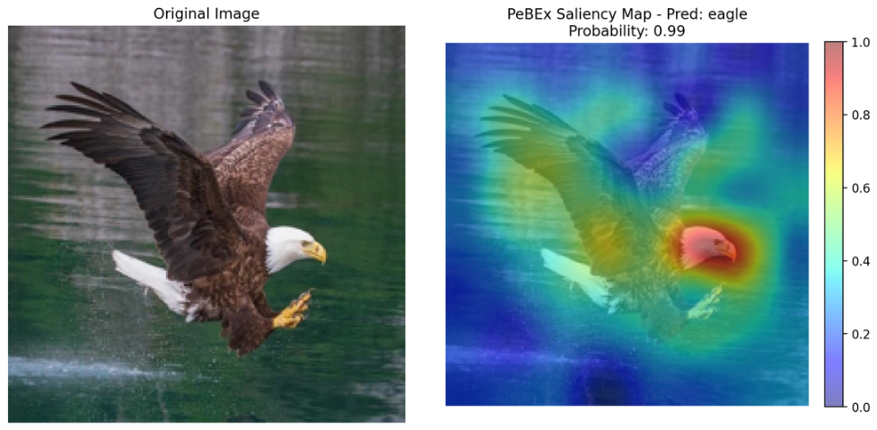

# PeBEx: An Efficient Perturbation-Based Explainability Method for AI Models

[](https://opensource.org/licenses/MIT)
[](https://www.python.org/downloads/)

## 📖 Introduction
Despite the considerable success of deep learning models in many complicated tasks, the lack of transparency in these models significantly poses a barrier to user trust. This issue has gradually emerged as a new challenge and as a foundation for the development of Explainable Artificial Intelligence (XAI). However, several XAI methods still suffer notable limitations, particularly with respect to reliability in explanations and computational cost. 

In this paper, we propose PeBEx, a perturbation-based explanation method specifically designed for image data. By generating perturbed versions of the original input and leveraging the corresponding prediction variations, PeBEx provides explanations by estimating the contribution of image regions. Experimental results indicate that PeBEx effectively identifies salient features while maintaining stability and accuracy in its explanations. These advantages position PeBEx as a promising tool for developing transparent and reliable AI systems

## 🌟 Workflow of PeBEx


**PeBEx explains the image by four following steps:**

***Step 1: Baseline prediction*** \
Given an input image $x$ and a trained classification model $f$. The main objective of the method is to construct an explanation map $I$ that reflects the contribution
of image regions to the model’s prediction.

***Step 2: Mask sampling***\
The input image is partitioned into a grid structure of size $gh × gw$. The Monte
Carlo sampling process is carried out by randomly generating binary perturbation samples, from which representative samples are drawn according to a Bernoulli distribution with probability $p$. Then, the number of Monte Carlo samples is chosen adaptively based on the grid resolution to ensure statistical reliability.

***Step 3: Importance estimation***\
The fundamental concept behind PeBEx is to evaluate how each specific region of an image influences the model's final decision. We achieve this by generating multiple randomly masked versions of the input image and observing the changes in the model's confidence.

For any given region $z$, we divide the model's prediction probabilities into two groups:
- "ON" group: Predictions where the region is kept visible.
- "OFF" group: Predictions where the region is masked.

By calculating the expected probability for both groups ($\mu_{on}$ and $\mu_{off}$), we can measure the region's contribution. Intuitively, if the model's confidence drops significantly when a region is hidden, that region is highly important for the classification.

To ensure the explanation remains stable and is not skewed by the randomness of the Monte Carlo sampling, the difference between these expectations is normalized by their variance.

***Step 4: Multi-grid fusion***\
All the above processes are performed under a single grid resolution. Therefore, when multiple grid structures are used, the explanation maps at different resolutions are averaged to produce the final explanation map.

## 📊 Evaluated Datasets & Models

As a tool built for computer vision tasks, the method was rigorously evaluated on three benchmark datasets:
* **Animals-90:** Consists of 90 distinct animal categories with significant variations in shape, color, and background context.
* **Caltech-101:** Contains 101 object categories with moderate intra-class variability.
* **Brain Tumor Dataset:** Consists of MRI brain images used for tumor classification, characterized by subtle structural differences and high noise levels.

Supported deep learning architectures include:
* **Transformer (Vision Transformer)**
* **EfficientNet-B3**
* **ResNet50**

**The explanation result after using PeBEx:**\


**Insertion-Deletion Comparision demonstrates how good PeBEx's performance is**:


## ⚙️ Installation
**Hardware Note:** The original experiments were conducted on a system equipped with 16GB RAM and an NVIDIA GeForce RTX 3050 GPU (4GB VRAM).\
**Software Note:** This repository requires Python **3.11 or lower**.

**To clone the repository**
```bash
git clone https://github.com/hbkhanh22/PeBEx---Effective-Perturbation-based-explanation-model
```

First, run the file **load_dataset.ipynb** to download the data.
```bash
jupyter notebook load_dataset.ipynb
```
Then, install the libraries in **requirements.txt**.
```bash
pip install -r requirements.txt
```
Next, you can run **main.py** to train the model and evaluate the explanation methods. 
```bash
python src/main.py
```
Or you can run **sample_explanation.ipynb** to see the explanation results in individual image. 
```bash
jupyter notebook sample_explanation.ipynb
```